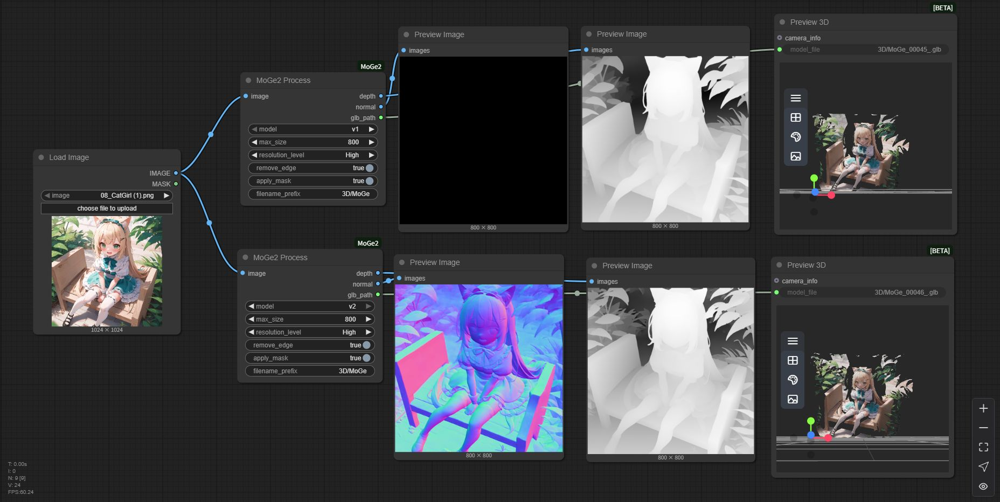

# Comfyui-MoGe2

[ComfyUI](https://github.com/comfyanonymous/ComfyUI) nodes to use [MoGe2](https://github.com/microsoft/MoGe) prediction.

Original repo: https://github.com/microsoft/MoGe

Huggingface demo: https://huggingface.co/spaces/Ruicheng/MoGe-2

## Updates

- [2025-01-19] **Critical slice alignment fixes**: Fixed z-buffer ray-distance validation (negative distances were breaking merge), disabled depth_alignment for ray mode (was causing order-dependent scale drift), added robust point magnitude filtering (rejects interpolation artifacts), and ensured borderMode consistency for normal remaps. These changes dramatically improve seam quality and eliminate slice misalignment artifacts.
- [2025-10-04] Panorama defaults tuned for clean GLBs: auto mask-relaxation, spike denoising, seam/pole smoothing, mesh cleanup, and GLB export enabled by default. README/Agents updated with recommended workflow.
- [2025-09-15] Panorama mode: default model `v2` with normals; default z-buffer merge (ray distance) for strongest metric consistency; GLB extra rotation option; hole filling; per-view exports; synthetic validation script; fixed segment misalignment (rotation order).
- [2025-07-29] Support `Ruicheng/moge-2-vitl-normal` and `Ruicheng/moge-vitl` model.

## Features

|version|model|3D|depth_map|normal_map|
|---|---|---|---|---|
|v1|[Ruicheng/moge-vitl](https://huggingface.co/Ruicheng/moge-vitl/tree/main)|✅|✅|❌|
|v2|[Ruicheng/moge-2-vitl-normal](https://huggingface.co/Ruicheng/moge-2-vitl-normal/tree/main)|✅|✅|✅|

> Using `v1` model to export `normal` will return black image instead of normal map. `Ruicheng/moge-vitl` does not support normal map.

## How to Use

### ComfyUI-Manager

Run ComfyUI → `Manager` → `Custom Nodes Manager` → search and install `Comfyui-MoGe2`

### Git Clone

1. Clone this repo to `ComfyUI/custom_nodes` 
2. Install requirements: `pip install -r requirements.txt`

### Panorama Mode (Metric)

- Use the `MoGe2Panorama` node to process equirectangular (360°) panoramas with metric-scale preservation and stitched normals.
- Requirements:
  - A local copy of the MoGe checkpoint folder(s). The node resolves a local path from the selected version or uses your `model_path` override. No network download is attempted.
  - Input must be an equirectangular panorama. Output resolution matches the input.
- Model selection:
  - `model` (v1/v2): Default is `v2` (normals + metric point map). `v1` omits normals but still exports depth/point clouds.
  - `model_path` (optional): Local override path. If provided and exists, it replaces the internal mapping.
- Recommended defaults (already applied in the node):
  - `face_resolution = 1024`: balances seam quality and runtime on 4 K panos; raise to 1536+ if VRAM allows.
  - `view_fov_x_deg = 110`: ensures generous overlap without extreme distortion.
  - `merge_method = z_buffer` + `zbuffer_mode = ray`: preserves metric scale by picking the closest intersection along the panorama ray.
  - `auto_relax_min_mask = True`, `min_valid_views = 14`: auto-reinstate views if mask-filtering leaves coverage gaps.
  - `polar_smooth = True`, `polar_cap_ratio = 0.10`, `polar_blur_ks = 9`: calms zenith/nadir spikes in GLBs.
  - `denoise_spikes = True`, `spike_sigma = 2.5`: removes stray ray-distance outliers before meshing.
  - `output_glb = True`, `mesh_wrap_x = True`, `glb_rotate_x_deg = 90`: exports a ready-to-view GLB with seam closure and viewer-friendly orientation.
- Seam and spike troubleshooting:
  - Switch to `merge_method = weighted` (optionally `affine_depth`) when you need per-view scale harmonisation before blending. Pair with `angle_power = 2–4` and `depth_alpha = 0.3–0.7` so centre pixels dominate across overlaps.
  - Increase `view_fov_x_deg` toward 115–118° plus `face_resolution` ≥ 1280 for more overlap and smoother seams on high-contrast structures. Higher values cost VRAM/time but reduce slice-to-slice jumps.
  - Keep `denoise_spikes = True` and raise `spike_sigma` to 3.0–3.5 for aggressive ray-distance outlier removal that prevents radial “fins” in the final mesh.
  - Leave `auto_relax_min_mask = True` and bump `min_valid_views` (e.g. 18) if large masked regions collapse coverage. This automatically loosens masks when too many slices get skipped.
  - Retain `fill_holes = True` with `hole_iters = 2–3` to close small invalid gaps without blurring geometry. For stubborn seams enable `horizontal_wrap` during remap to borrow wrapped texels at the panorama seam.
  - For final polishing try `merge_method = poisson_depth` after a clean z-buffer pass; it solves depth gradients for smooth seams while respecting metric distances.
  - Enable `export_per_view = True` when debugging to inspect per-camera PLY/GLB outputs and compare against the merged panorama.
  - Stick with `model = v2` for normals and metric scale; v1 lacks normals and is only recommended when VRAM is extremely limited.
- Other key controls:
  - `skip_small_masks` + `min_mask_ratio`: still reject tiny/noisy views; auto relax backfills if too many are skipped.
  - `fill_holes`/`hole_iters`: fills isolated gaps post-merge (defaults keep seams tight without softening geometry).
  - `export_depth` + `depth_format`: optional quantized (PNG16, mm), floating (EXR), or both depth exports.
  - `export_per_view`: per-view PLY/GLB for QA of individual virtual cameras (off by default to save time).
  - `mask_image` + `multi_glb_from_mask`: supply a label panorama to split the final mesh into per-label GLBs.
  - `resolution_level`: MoGe inference granularity. `Ultra` is default for highest fidelity; drop to `High` if VRAM is tight.
  - `use_fp16`: keep enabled unless you are debugging numerical issues.
- Outputs:
  - `depth`: Panorama depth visualization (closer appears brighter in the preview).
  - `normal`: Panorama normal visualization (world-space, stitched from views).
- `pcl_path`: Saved point cloud path (STRING, `.ply`).
- `glb_path`: Saved textured mesh path (STRING, `.glb`). If multiple per-label GLBs are exported, this string contains multiple lines: the main GLB (if enabled) and then one path per label GLB.
 - `depth_file`: Path(s) to exported depth files (one per line if multiple formats were chosen).

### Example Workflow

See `example_workflows/MoGe2Panorama_LabelExport.json` for a simple setup that:
- Loads a panorama and a label mask,
- Runs `MoGe2Panorama` with `multi_glb_from_mask` enabled,
- Saves the depth visualization, and exports per‑label GLBs.

#### Misalignment Fix (Rotation Order)

- Fixed per-segment misalignment due to a rotation-order bug when converting camera-frame outputs to world space.
- Now uses row-vector convention `x_world = x_cam @ R` (where `R` is world→camera rotation) to rotate points/normals into the global panorama frame.
- Seam alignment and metric consistency across views should be preserved.

#### Synthetic Validation

- A synthetic validation script verifies the rotation and seam alignment logic without model weights.
- Run: `python scripts/validate_panorama.py`
- Outputs under `outputs/validate_panorama/`:
  - `diff_heatmap.png`: normalized 3D error heatmap (should be ~0 on a unit sphere test).
  - `mask.png`: merged valid mask.

Example workflow: `example_workflows/MoGe2Panorama.json`

## Model Support

- [x] [Ruicheng/moge-2-vitl-normal](https://huggingface.co/Ruicheng/moge-2-vitl-normal/tree/main)
- [x] [Ruicheng/moge-vitl](https://huggingface.co/Ruicheng/moge-vitl/tree/main)

## Acknowledgements

I would like to thank the contributors to the [MoGe](https://github.com/microsoft/MoGe), [ComfyUI-MoGe](https://github.com/kijia), for their open research.

